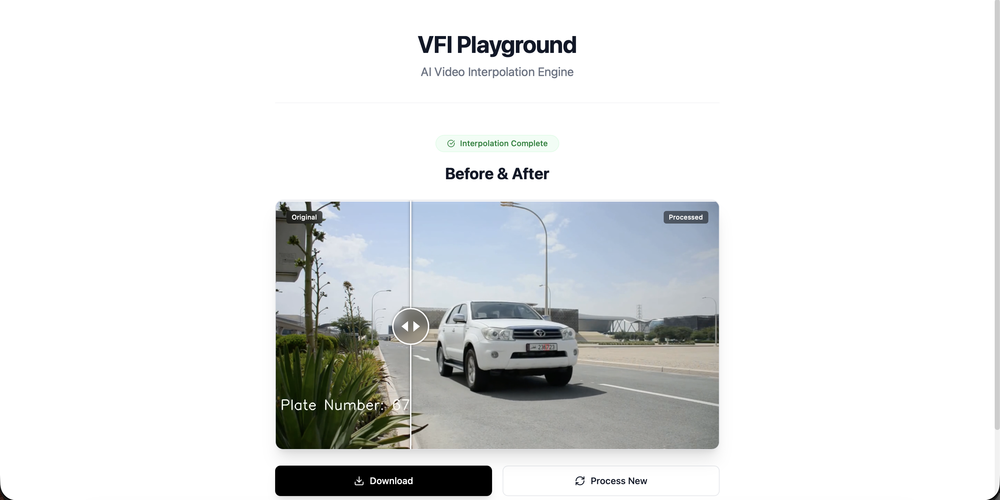

# VFI Playground

**AI-Powered Video Frame Interpolation Engine**

[Watch Demo Video](https://youtu.be/sJk6sCPXD6Y)

VFI Playground is a high-performance, web-based tool for video temporal upsampling. It leverages deep learning techniques—specifically the RIFE (Real-Time Intermediate Flow Estimation) architecture—to generate intermediate frames between existing video frames, effectively increasing the frame rate and fluidity of video content.

This application is engineered for researchers and developers to analyze motion estimation quality, compare interpolation strategies, and process video content with recursive batch inference.



## Core Capabilities

### 1. RIFE Neural Interpolation
The core engine utilizes a pre-trained RIFE model to estimate bi-directional optical flow. Unlike traditional linear blending, RIFE warps pixels based on estimated motion vectors, preserving object structure and reducing ghosting artifacts during fast motion.

### 2. Recursive Multi-Frame Generation (2x & 4x)
- **2x Inference**: Generates one intermediate frame per pair of input frames.
- **4x Recursive Inference**: Performs a second pass on the generated frames to quadruple the original frame rate (e.g., 30fps -> 120fps).

### 3. Hardware-Accelerated Batch Processing
The Python backend implements a custom batching pipeline (Batch Size: 4) to maximize GPU/MPS throughput. It handles:
- **Automatic Device Selection**: CUDA (NVIDIA), MPS (Apple Silicon), or CPU.
- **Color Space Management**: Automatic BGR-to-RGB conversion for inference and loss-less reconstruction.

### 4. Analysis Tools
- **Optical Flow Visualization**: Renders the raw motion vectors estimated by the model, allowing visual debugging of flow magnitude and direction.
- **Side-by-Side Comparison**: dedicated comparison view with synchronized playback to evaluate the interpolated result against the original footage.

## Technical Architecture

### Backend
- **Framework**: Python 3.9+, FastAPI
- **ML Engine**: PyTorch
- **Video Processing**: OpenCV (cv2) with H.264 (avc1) encoding for broad browser compatibility.
- **Task Management**: Asynchronous background worker for non-blocking inference.

### Frontend
- **Framework**: React 18, Vite
- **Styling**: TailwindCSS
- **State Management**: Local component state with efficient polling for task progress.

## Installation & Setup

### Prerequisites
- Python 3.9 or higher
- Node.js 16 or higher
- FFmpeg (required for OpenCV video I/O)

### 1. Backend Setup
```bash
cd backend
pip install -r requirements.txt
./run_backend.sh
```
The server will start on `http://localhost:8000`.

### 2. Frontend Setup
```bash
cd frontend
npm install
./run_frontend.sh
```
The application will be accessible at `http://localhost:5173`.

## Usage

1. **Upload**: Drag and drop a video file supported by OpenCV (mp4, mov, avi).
2. **Configure**:
   - Select Target Speed (**2x** or **4x**).
   - Select Visualization Mode (**Standard** or **Optical Flow**).
3. **Process**: The backend will queue the job and stream progress updates.
4. **Analyze**: Use the comparison slider to verify smoothness and artifact reduction.

## License
MIT License
